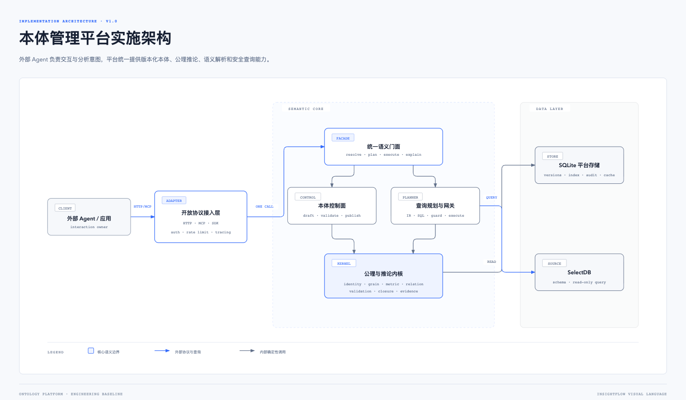
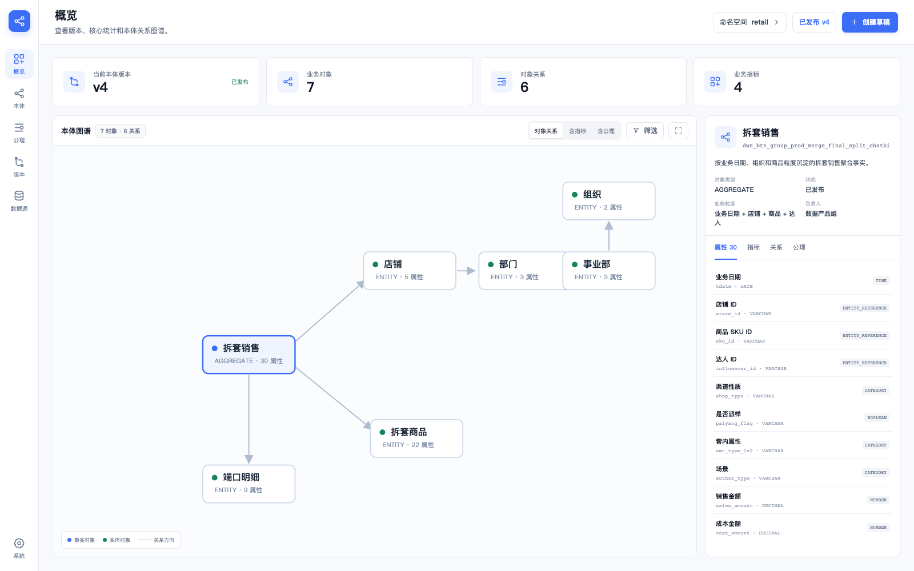
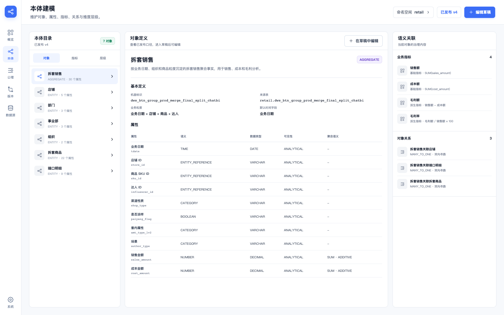
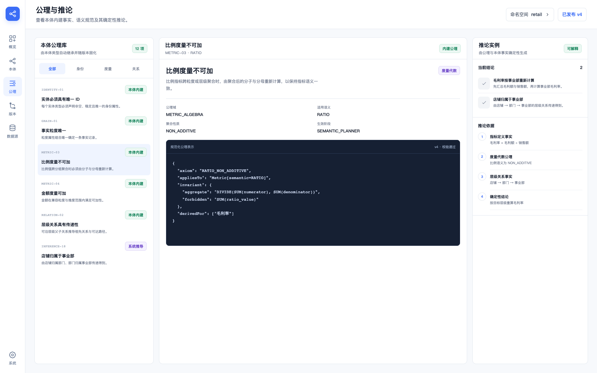
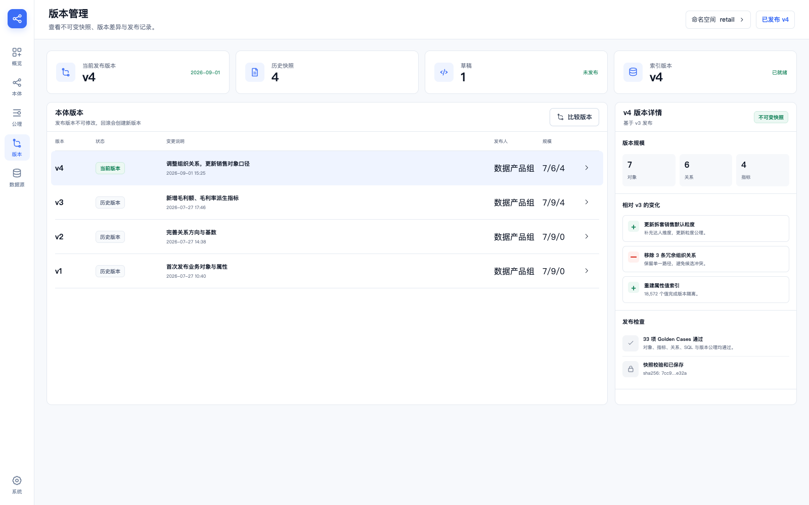
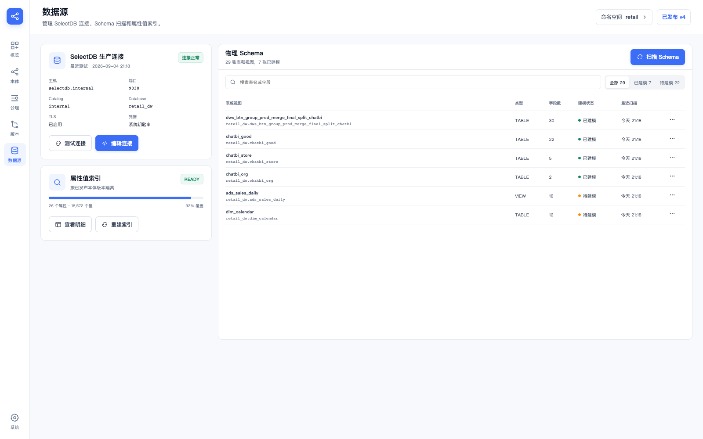
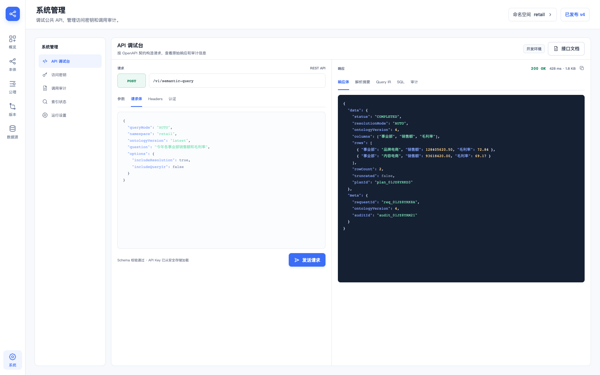

---

document_id: ontology-platform-implementation-spec
version: 1.0
status: APPROVED_BASELINE
updated_at: 2026-09-04
audience: implementation-agent, backend-engineer, frontend-engineer, qa-engineer
source_product: insightflow-data-agent

---

# 独立本体管理平台功能实施规格

## 0. Agent 执行契约

本文档是本项目当前阶段的实施事实源。实施 Agent 必须按以下优先级处理信息：

1. 本文档中的 MUST、MUST NOT、SHOULD 和验收标准。
2. `./prototype/` 中已经确认的静态原型与页面行为。
3. `insightflow-data-agent` 中现有的本体、语义运行时、Query IR、SQL 编译和值索引实现。
4. 其他实现细节由 Agent 在不改变上述契约的前提下决定。

实施 Agent 必须遵守：

- 外部 Agent 或业务应用负责用户交互、分析目标和结果表达。
- 平台负责本体生命周期、语义解析、公理、推论、查询规划、SQL 安全和审计。
- HTTP API、SDK 和 MCP 只做协议适配，所有语义行为必须复用同一个 Application/Domain 内核。
- 一次请求或语义会话必须固定到一个明确的本体版本。
- 公理是本体内建事实与规范，由内核依据对象、属性、指标、关系和层级定义自动实例化。
- 推论必须是确定性的，并返回可追溯的前提、公理和证据路径。
- MVP 平台存储采用 SQLite；图谱由本体版本快照与关系投影生成。
- 普通明确问数的目标是一次外部调用完成。
- UI 结构、密度、导航和交互以 `./prototype/` 中的确认版原型为准。

任何阶段只有在对应自动化测试通过后才能进入下一阶段。

## 1. 产品目标

建设一个独立、协议开放、可版本化的本体管理与语义执行平台，使任意外部 Agent 或应用通过 MCP、HTTP API 或 SDK 获得与 InsightFlow 当前语义能力等价的服务。

平台必须完整承载：

- 本体命名空间与版本。
- 业务对象、对象类型和业务粒度。
- 值属性、属性语义、物理字段映射、可见性和值索引配置。
- 对象关系、方向、基数、必选性、聚合风险和层级。
- 基础指标、派生指标、依赖图与聚合语义。
- 本体内建公理、公理实例及发布校验。
- 关系闭包、层级可达性、指标依赖和其他确定性推论。
- 语义检索、值绑定、分析空间、Query IR、SelectDB SQL 编译和只读执行。
- 版本化证据、请求审计、错误码与完整性信息。

### 1.1 成功标准

1. 外部 Agent 可以读取完整本体或按问题获取紧凑语义上下文。
2. 外部 Agent 可以通过一次 `ExecuteSemanticQuery` 完成明确问数。
3. 语义歧义时，平台一次返回完整澄清集合，并通过一次继续调用完成执行。
4. 同一版本、同一输入得到相同候选顺序、路径、推论和 Query IR。
5. 发布版本不可变，旧会话始终使用创建时固定的版本。
6. 页面能够完成本体浏览、建模、发布、数据源管理、API 调试和审计查看。

### 1.2 系统边界

| 责任 | 归属 |
|---|---|
| 对话、多轮表达、业务分析策略 | 外部 Agent |
| 本体编辑、校验、发布、版本 | 本平台 |
| 公理实例化、确定性推论、证据 | 本平台 |
| 语义检索、值绑定、分析空间 | 本平台 |
| Query IR、SQL 编译、只读防护 | 本平台 |
| 数据查询 | SelectDB 适配器 |
| 结果解读与面向用户的回答 | 外部 Agent |

## 2. 现有能力迁移矩阵

| InsightFlow 现有能力 | 新平台模块 | 保留要求 |
|---|---|---|
| OntologySnapshot v2 | Ontology Contracts v3 | 保留所有对象、属性、指标、关系、层级和稳定 ID |
| 草稿、校验、发布 | Ontology Control Plane | 发布快照不可变；发布采用原子流程 |
| `validateOntology` | Axiom & Validation Kernel | 将隐含校验显式映射为公理实例和稳定错误码 |
| Semantic Search | Semantic Runtime | 结果可复现；只使用已发布版本 |
| Analysis Space | Semantic Runtime | 一次只选择一个可度量事实对象 |
| Property Value Index | Value Index | 按命名空间和本体版本隔离 |
| Query IR | Query Planner | 保留强类型意图与参数化编译 |
| Doris/SelectDB SQL Compiler | SelectDB Query Gateway | 保留聚合、时间比较、派生计算、分页和安全限制 |
| SQL Guard | Query Gateway | 只读、单语句、参数化、强制行数限制 |
| Turn trace / evidence | Audit & Evidence Store | 改为与具体 Agent 无关的请求级证据链 |
| Montane Tool Registry | MCP Adapter | 工具调用统一映射到 Application 层 |
| Web 本体与设置页面 | Management Console | 采用本规格中的确认版页面 |

迁移工具必须支持读取 InsightFlow 的 `ontology.sqlite` 和 OntologySnapshot v2，将其转换为 v3，并通过新内核生成公理实例、推论闭包和证据摘要。

## 3. 总体架构

[可打开的自包含架构图](./architecture.html)



### 3.1 组件职责

| 组件 | 职责 | 主要输入 | 主要输出 |
|---|---|---|---|
| Open Protocol Adapters | HTTP、MCP、SDK、认证、限流、追踪 | 外部请求 | Application Command |
| Unified Semantic Facade | 模式路由和单次调用编排 | 问题、Query Shape、参数 | 结果、澄清或分析上下文 |
| Ontology Control Plane | 草稿、校验、发布、版本和导入 | Schema、Draft Patch | Draft、Validation、Snapshot |
| Axiom & Inference Kernel | 公理实例化、约束检查、关系闭包、推论证据 | Ontology Snapshot | Assertions、Inferences、Issues |
| Semantic Runtime | 检索、分析空间、值绑定、紧凑上下文 | 问题框架、业务词和值 | Context Bundle、短引用 |
| Query Planner | 关系寻路、粒度与可加性判断、Query IR | Analysis Intent | Validated Query IR |
| Query Gateway | SQL 编译、防护、执行和分页 | Query IR | SQL Preview、Query Result |
| SQLite Stores | 版本、草稿、索引、缓存、会话和审计 | Domain Records | Versioned Records |
| SelectDB Adapter | Schema 扫描与只读查询 | SQL、Parameters | Physical Catalog、Rows |

### 3.2 依赖方向

```text
adapters -> application -> domain <- contracts
api/mcp/sdk -> application
domain -> no framework, database, HTTP, MCP, LLM or environment dependency
```

### 3.3 技术基线

| 层 | 选择 |
|---|---|
| Runtime | Node.js 24+、TypeScript strict |
| API | Fastify、Zod、OpenAPI 3.1 |
| Console | React 19、Vite、TypeScript |
| Platform Store | SQLite、WAL、foreign_keys=ON |
| Analytical Source | SelectDB/MySQL protocol adapter |
| Graph Rendering | ECharts Graph 或等价 Canvas/SVG 有向图 |
| MCP | 独立 adapter package，调用同一 Application services |
| Tests | Vitest、契约测试、Playwright E2E |

## 4. 领域模型

### 4.1 Ontology Snapshot v3

```ts
interface OntologySnapshotV3 {
  schemaVersion: 3;
  namespace: string;
  version: number;
  baseVersion?: number;
  status: "DRAFT" | "VERIFIED" | "PUBLISHED" | "DEPRECATED";
  publishedAt?: string;
  contentDigest: string;

  objects: OntologyObject[];
  relations: OntologyRelation[];
  metrics: Metric[];
  dimensionHierarchies: DimensionHierarchy[];

  axiomAssertions: AxiomAssertion[];
  inferredAssertions: InferredAssertion[];
  inferenceDigest: string;
}
```

v2 中的 `OntologyObject`、`OntologyProperty`、`OntologyRelation`、`Metric` 和 `DimensionHierarchy` 字段全部保留。新字段必须采用向后兼容的迁移器生成，禁止重新生成已有稳定 ID。

### 4.2 对象

支持五类对象：

| 类型 | 身份与粒度语义 |
|---|---|
| `ENTITY` | 必须且只能有一个唯一 ID；ID 即有效粒度 |
| `EVENT` | 最多一个 ID；没有 ID 时必须声明组合粒度 |
| `SNAPSHOT` | 使用组合粒度；通常包含时间属性 |
| `AGGREGATE` | 使用组合粒度；声明预聚合层级 |
| `RELATIONSHIP` | 至少两个实体引用；使用组合粒度 |

对象至少包含稳定 ID、机器标识、业务名称、描述、来源表、对象类型、粒度属性、默认时间属性、默认过滤、同义词、绑定优先级和属性集合。

### 4.3 值属性

属性语义保持十类：

`ID | CODE | NAME | ENTITY_REFERENCE | CATEGORY | TIME | NUMBER | BOOLEAN | GEOGRAPHY | TEXT`

每个 NUMBER 属性必须包含：

```ts
interface NumericPropertySpec {
  kind: "GENERAL" | "CURRENCY" | "RATIO";
  unit?: string;
  currency?: string;
  defaultAggregation: "SUM" | "AVG" | "MIN" | "MAX" | "NONE";
  aggregationBehavior: "ADDITIVE" | "SEMI_ADDITIVE" | "NON_ADDITIVE";
}
```

属性值索引只覆盖显式允许检索、非敏感且分析可见的 CODE、NAME、CATEGORY、BOOLEAN 和 GEOGRAPHY 属性。

### 4.4 指标

- `BASE` 指标引用一个事实对象，可使用可视化聚合或受治理表达式。
- `DERIVED` 指标引用同一事实对象内的指标依赖图。
- 除法和比例必须使用 `NULLIF` 保护分母。
- 比例指标的跨层级结果必须由聚合后的分子与分母重新计算。
- 指标依赖必须无环且版本内可解析。

### 4.5 关系与层级

关系类型：

`REFERENCE | COMPOSITION | ASSOCIATION | HIERARCHY | EVENT_PARTICIPATION | IDENTITY | DERIVED`

每条关系必须包含 source、target、类型、基数、方向、关联属性、必选性、启用状态和 fanout 风险。关系寻路必须遵守方向，聚合安全必须由当前遍历方向上的基数决定。

层级支持：

- `FIXED_LEVELS`：固定层数，如店铺 → 部门 → 事业部 → 组织。
- `ADJACENCY_LIST`：递归父子结构，可选闭包表映射和最大深度。

### 4.6 公理模型

公理定义属于内核版本，不通过管理台创建。对象、属性、指标、关系和层级定义会触发对应公理的实例化。

```ts
type AxiomDomain =
  | "IDENTITY"
  | "GRAIN"
  | "TYPE"
  | "METRIC_ALGEBRA"
  | "RELATION"
  | "HIERARCHY"
  | "VISIBILITY";

interface AxiomAssertion {
  id: string;
  axiomCode: string;
  kernelVersion: string;
  domain: AxiomDomain;
  subjectType: "OBJECT" | "PROPERTY" | "METRIC" | "RELATION" | "HIERARCHY";
  subjectId: string;
  parameters: Record<string, unknown>;
  sourceDefinitionIds: string[];
  enforcement:
    | "DRAFT_VALIDATION"
    | "PUBLISH_VALIDATION"
    | "SEMANTIC_PLANNING"
    | "QUERY_COMPILATION";
  severity: "ERROR" | "WARNING" | "INVARIANT";
}

interface InferredAssertion {
  id: string;
  predicate: string;
  subjectId: string;
  objectId?: string;
  value?: unknown;
  ontologyVersion: number;
  axiomAssertionIds: string[];
  premiseAssertionIds: string[];
  proof: ProofStep[];
  materialization: "PUBLISHED" | "ON_DEMAND";
  deterministic: true;
}

interface ProofStep {
  sequence: number;
  kind: "FACT" | "AXIOM" | "DERIVATION";
  refId: string;
  statement: string;
}
```

### 4.7 MVP 公理目录

| 公理代码 | 触发条件 | 规范或推论 |
|---|---|---|
| `IDENTITY_ENTITY_SINGLE` | 对象类型为 ENTITY | 必须恰好一个 ID |
| `IDENTITY_ID_UNIQUE` | 属性语义为 ID | 属性必须非空、唯一、分析可见 |
| `GRAIN_REQUIRED` | 对象可形成事实记录 | 必须存在有效粒度 |
| `GRAIN_PROPERTIES_VALID` | 使用组合粒度 | 所有粒度属性必须存在且分析可见 |
| `NUMBER_SPEC_REQUIRED` | 属性语义为 NUMBER | 必须声明数字种类、默认聚合和可加性 |
| `RATIO_NON_ADDITIVE` | 数字或指标语义为 RATIO | 禁止累加；可由分子分母重算 |
| `SEMI_ADDITIVE_TIME` | 聚合行为为 SEMI_ADDITIVE | 禁止跨时间直接求和 |
| `METRIC_SINGLE_FACT` | 指标依赖存在 | 所有依赖属于同一事实对象 |
| `METRIC_DEPENDENCY_ACYCLIC` | 派生指标 | 依赖图必须无环 |
| `RELATION_TARGET_ID` | 关系使用目标属性 | 目标必须是目标对象 ID |
| `RELATION_DIRECTIONAL_PATH` | 执行关系寻路 | 只允许按声明方向遍历 |
| `RELATION_CARDINALITY_FANOUT` | 聚合路径包含关系 | 扇出路径必须拒绝或使用明确的主子聚合语义 |
| `HIERARCHY_TRANSITIVE` | 存在有效层级链 | 可推导祖先、后代和可达路径 |
| `VISIBILITY_SENSITIVE` | 属性标记敏感 | 不进入 Agent 上下文、值索引或导出 |

### 4.8 推论示例

输入事实：

```text
店铺 --MANY_TO_ONE--> 部门
部门 --MANY_TO_ONE--> 事业部
毛利率 = 毛利额 / 销售额
毛利额、销售额均为可加金额
```

内核输出：

```text
店铺归属于事业部
拆套销售可以沿店铺、部门路径按事业部聚合
事业部毛利率 = SUM(毛利额) / NULLIF(SUM(销售额), 0)
```

每条输出都必须携带事实前提、公理实例、推导顺序和本体版本。

## 5. 生命周期与发布

```text
DRAFT -> VERIFIED -> PUBLISHED -> DEPRECATED
```

发布流程必须原子化：

```text
读取草稿与 baseVersion
-> 运行结构校验
-> 实例化全部公理
-> 运行公理校验
-> 计算层级与关系闭包
-> 生成确定性推论
-> 计算 contentDigest 和 inferenceDigest
-> 写入不可变 PUBLISHED 快照
-> 更新 namespace latestVersion
-> 写入 OntologyPublished 审计事件
-> 异步构建属性值索引与 Query Shape 缓存
```

约束：

- 发布时必须检查 baseVersion，冲突返回 `ONTOLOGY_VERSION_CONFLICT`。
- 已发布记录只能读取或废弃，不能原地修改。
- 推论结果必须可从同一快照和同一 kernelVersion 重新生成。
- 值索引构建失败不影响本体发布，但必须暴露状态和错误。

## 6. SQLite 存储设计

| 表 | 主键 | 用途 |
|---|---|---|
| `namespaces` | namespace | latestVersion、状态、显示名 |
| `ontology_drafts` | namespace + draftId | baseVersion、可变 payload、更新时间 |
| `ontology_versions` | namespace + version | 不可变 snapshot、digest、发布时间 |
| `axiom_assertions` | namespace + version + id | 版本化公理实例投影 |
| `inferred_assertions` | namespace + version + id | 推论与证据投影 |
| `physical_sources` | sourceId | 安全连接配置，不含明文密码 |
| `physical_tables` | sourceId + tableId | 表、列、指纹和扫描状态 |
| `property_value_index` | namespace + version + propertyId + normalizedValue | 业务值、频次 |
| `property_value_index_status` | namespace + version + propertyId | ready/partial/empty/failed |
| `semantic_sessions` | sessionId | 固定版本、短引用目录和过期时间 |
| `query_shape_cache` | namespace + version + fingerprint | 已校验 IR 模板和参数定义 |
| `audit_events` | auditId + sequence | 只追加证据链 |
| `api_clients` | clientId | scopes、状态、密钥哈希和轮换时间 |

存储实现要求：

- 开启 WAL 与外键。
- 发布快照保存完整 JSON，公理与推论表作为可重建查询投影。
- 所有版本相关表都必须包含 namespace 与 ontologyVersion。
- API 密钥只保存不可逆哈希；数据源密码使用操作系统安全存储或部署密钥加密。
- 审计正文不得保存密钥、密码和敏感属性值。

## 7. HTTP API 契约

### 7.1 通用约定

- Base path：`/v1`。
- 认证：`Authorization: Bearer <api-key>`。
- 请求幂等：写接口支持 `Idempotency-Key`。
- 版本选择：省略或传 `latest` 时，服务端在请求开始即解析为具体版本。
- 并发控制：草稿写入携带 `If-Match` 或 draft revision。
- 全量读取：响应 `ETag = contentDigest`，支持 `If-None-Match`。

标准响应：

```json
{
  "requestId": "req_...",
  "namespace": "retail",
  "ontologyVersion": 4,
  "status": "SUCCEEDED",
  "data": {},
  "warnings": [],
  "auditId": "audit_...",
  "completeness": {
    "complete": true,
    "truncated": false,
    "nextCursor": null
  }
}
```

### 7.2 管理与读取接口

| Method | Path | Scope | 作用 |
|---|---|---|---|
| GET | `/namespaces/:ns/summary` | `ontology:read` | 版本、对象、关系、指标、公理和索引概览 |
| GET | `/namespaces/:ns/ontology` | `ontology:read` | 读取完整或投影后的版本快照 |
| GET | `/namespaces/:ns/graph` | `ontology:read` | 返回有向图 nodes、edges、布局提示 |
| GET | `/namespaces/:ns/versions` | `ontology:read` | 版本列表 |
| GET | `/namespaces/:ns/versions/:version/diff` | `ontology:read` | 结构、公理和推论差异 |
| POST | `/namespaces/:ns/drafts` | `ontology:draft` | 从指定版本创建草稿 |
| GET | `/namespaces/:ns/drafts/:draftId` | `ontology:draft` | 读取草稿 |
| PATCH | `/namespaces/:ns/drafts/:draftId` | `ontology:draft` | 原子应用 Draft Patch |
| POST | `/namespaces/:ns/drafts/:draftId/validate` | `ontology:draft` | 结构与公理校验 |
| POST | `/namespaces/:ns/drafts/:draftId/publish` | `ontology:publish` | 发布新版本 |
| GET | `/namespaces/:ns/axioms` | `ontology:read` | 查看公理目录和版本实例 |
| GET | `/namespaces/:ns/inferences` | `ontology:read` | 查看版本推论 |
| GET | `/namespaces/:ns/inferences/:id/explanation` | `ontology:read` | 查看完整证据路径 |

`GET /ontology` 支持：

```text
version=latest|number
projection=compact|standard|full
include=objects,properties,relations,metrics,hierarchies,axioms,inferences
```

### 7.3 统一语义上下文

`POST /semantic-context:resolve` 用于外部 Agent 一次取得与任务相关的完整本体上下文。

```ts
interface ResolveSemanticContextInput {
  namespace: string;
  ontologyVersion?: number | "latest";
  question?: string;
  terms?: string[];
  purpose: "ANSWER" | "PLAN" | "EXPLAIN" | "MODEL";
  projection?: "compact" | "standard" | "full";
  include?: {
    values?: boolean;
    axioms?: boolean;
    inferences?: boolean;
    evidence?: boolean;
  };
}
```

返回内容必须在一个 envelope 内包含：

- 已固定的本体版本。
- 相关对象、属性、指标、关系和层级。
- 匹配到的业务值及绑定引用。
- 适用公理和已知推论。
- 关系路径、粒度和可加性摘要。
- 会话短引用 O/M/D/R/B/A/I。
- 候选歧义和一次性澄清选项。
- contextDigest 与 tokenEstimate。

### 7.4 统一语义查询

`POST /semantic-query` 是普通 Agent 的主入口。

```ts
interface ExecuteSemanticQueryInput {
  queryMode: "AUTO" | "FIXED_SHAPE" | "ANALYSIS";
  namespace: string;
  ontologyVersion?: number | "latest";
  question?: string;
  queryShape?: FixedQueryShape;
  parameters?: Record<string, unknown>;
  sessionId?: string;
  pagination?: {
    pageSize?: number;
    cursor?: string;
  };
  options?: {
    includeResolution?: boolean;
    includeOntologyContext?: boolean;
    includeAxioms?: boolean;
    includeInferenceEvidence?: boolean;
    includeQueryIr?: boolean;
    includeSqlPreview?: boolean;
  };
}
```

响应状态：

| 状态 | 含义 | Agent 下一步 |
|---|---|---|
| `SUCCEEDED` | 已完成解析、规划和执行 | 使用结果回答 |
| `NEEDS_CLARIFICATION` | 存在一个或多个歧义 | 提交一次继续请求 |
| `ANALYSIS_READY` | 已创建分析会话和验收合同 | 选择证据计划 |
| `REJECTED` | 公理或安全约束不满足 | 向用户解释稳定错误 |
| `FAILED` | 运行条件或系统错误 | 按 retryable 标志处理 |

继续接口：

`POST /semantic-query/clarifications/:clarificationId:continue`

请求必须一次提交所有已选候选。服务端复用原始问题、固定版本和已完成的内部阶段。

### 7.5 数据源、索引和系统接口

| Method | Path | 作用 |
|---|---|---|
| GET/PUT | `/data-sources/:sourceId` | 查看或更新安全连接配置 |
| POST | `/data-sources/:sourceId:test` | 测试连接 |
| POST | `/data-sources/:sourceId/schema:scan` | 扫描物理 Schema |
| GET | `/namespaces/:ns/value-index/status` | 查看索引状态 |
| POST | `/namespaces/:ns/value-index:rebuild` | 重建当前发布版本索引 |
| GET/POST/DELETE | `/system/api-clients` | 管理调用方和密钥 |
| GET | `/system/audit-events` | 查询调用审计 |
| GET | `/system/openapi.json` | API 调试台事实源 |
| GET | `/health` | 健康状态和组件版本 |

## 8. MCP 契约

### 8.1 主工具

| Tool | 用途 | 默认调用场景 |
|---|---|---|
| `ResolveOntologyContext` | 一次返回任务相关本体、公理、推论和证据 | 外部 Agent 需要自行规划 |
| `ExecuteSemanticQuery` | 一次完成解析、绑定、计划、SQL 和执行 | 普通明确问数 |
| `ContinueSemanticQuery` | 提交完整澄清选择并继续 | 仅 NEEDS_CLARIFICATION |

### 8.2 管理工具

| Tool | Scope | 用途 |
|---|---|---|
| `GetOntologySnapshot` | `ontology:read` | 获取版本化完整快照 |
| `ApplyOntologyDraftPatch` | `ontology:draft` | 批量更新对象、属性、指标、关系或层级 |
| `ValidateOntologyDraft` | `ontology:draft` | 获取公理校验结果 |
| `PublishOntologyDraft` | `ontology:publish` | 发布不可变版本 |
| `ExplainInference` | `ontology:read` | 获取推论证据路径 |

MCP adapter 必须：

- 直接调用 Application services 或统一 HTTP client。
- 使用与 OpenAPI 相同的 JSON Schema 和错误码。
- 不实现语义匹配、关系寻路、公理判断或 SQL 生成。
- 不把数据库凭据、内部 SQL 标识和敏感属性暴露给 Agent。
- 对大结果返回资源句柄或分页游标。

## 9. 外部交互次数优化

### 9.1 调用预算

| 场景 | 目标调用次数 |
|---|---:|
| 获取与一个问题相关的完整本体上下文 | 1 |
| AUTO 明确问数 | 1 |
| AUTO 存在语义歧义 | 2，初始请求 + 一次继续 |
| FIXED_SHAPE 每页取数 | 1 |
| ANALYSIS 初始化 | 1 |
| ANALYSIS 每条证据计划 | 1 |
| 推论解释 | 1 |

### 9.2 实现机制

1. Semantic Context Bundle 一次返回对象、属性、指标、关系、值绑定、公理、推论和证据。
2. `ExecuteSemanticQuery` 内部完成 Question Frame、检索、值绑定、路径、IR、SQL 和执行。
3. 一次返回全部澄清项，避免逐字段确认。
4. FIXED_SHAPE 使用结构指纹与编译缓存，动态值只进入 parameters。
5. 相同 contextDigest 支持 ETag 和客户端缓存。
6. 响应支持 compact/standard/full 投影，控制 Agent token 消耗。
7. 错误响应携带稳定 code、action 和候选，不要求 Agent 重新搜索错误原因。

## 10. 管理控制台与确认版原型

### 10.1 全局视觉与导航

- 左侧窄栏全局导航：概览、本体、公理、版本、数据源、系统。
- 顶栏展示页面标题、说明、命名空间和已发布版本。
- 视觉语言采用 InsightFlow 的浅色工作台、蓝色主色、细边框、高信息密度和紧凑间距。
- 图标使用统一线性图标体系，不使用装饰性插画。
- 桌面优先基准尺寸为 1600 × 1000；最小支持宽度 1280。
- 所有列表、筛选和详情必须有 loading、empty、error 和 permission-denied 状态。

原型源码：

- [静态原型入口](./prototype/index.html)
- [样式](./prototype/styles.css)
- [页面数据与结构](./prototype/app.js)

### 10.2 概览



功能：

- 顶部指标卡：当前版本、对象数量、关系数量、指标数量。
- 主区域展示有向本体图，节点区分对象类型，边显示方向和关系。
- 支持对象关系、指标和公理三种图谱投影。
- 点击节点后右侧展示对象类型、业务粒度、来源、属性、指标、关系和适用公理。
- 图谱支持搜索、筛选、缩放、复位、适应视口和全屏。
- 数据来自 `GET /namespaces/:ns/summary` 与 `GET /namespaces/:ns/graph`。

验收：

- 首屏可以在一次 API 聚合请求中获得统计、图谱和默认选中对象。
- 节点选中状态和右侧详情同步。
- 有向边方向在缩放后仍清晰可辨。

### 10.3 本体建模



三栏结构：

1. 左栏：对象、指标、层级目录及搜索。
2. 中栏：对象定义、来源表、粒度、默认时间、属性表。
3. 右栏：当前对象的指标、关系、层级和语义关联。

编辑行为：

- 已发布版本只读。
- 创建草稿后允许编辑业务语义和映射字段。
- 物理字段名称和数据类型由 Schema 扫描结果约束。
- Draft Patch 支持一次提交对象、关联指标、关系和层级变更。
- 保存后立即显示受影响的公理校验项。

### 10.4 公理与推论



功能：

- 左栏按身份、粒度、类型、度量代数、关系、层级和可见性展示公理实例。
- 中栏展示公理定义、适用对象、参数、内核版本、生效阶段和规范化表示。
- 右栏展示由当前公理参与生成的推论及证据路径。
- 支持按本体版本、对象和公理域筛选。
- 支持从推论跳转到对象、关系、指标或层级定义。

交互边界：

- 页面提供查看、筛选、解释和定位能力。
- 公理实例由本体定义与内核自动生成。
- 对对象、属性、指标、关系或层级的修改在草稿页面完成。

### 10.5 版本管理



功能：

- 版本列表显示状态、发布时间、发布者、变更说明和规模。
- 详情显示相对基线版本的对象、属性、关系、指标、公理和推论差异。
- 发布前显示校验摘要、Golden Cases 和 digest。
- 回滚通过从历史版本创建新草稿实现。
- 已发布版本支持下载完整快照。

### 10.6 数据源与值索引



功能：

- 查看和维护 SelectDB 连接、Catalog、Database、TLS 和凭据状态。
- 测试连接并显示数据库版本、耗时和最近结果。
- 扫描物理 Schema，显示建模状态和字段指纹。
- 查看值索引属性数、值数量、覆盖率和状态。
- 支持按已发布本体版本重建值索引。

### 10.7 系统管理与 API 调试台



调试台必须由 OpenAPI 生成或读取接口元数据，支持：

- 选择 Method 和 Endpoint。
- 设置 namespace、ontologyVersion、认证客户端和请求头。
- 编辑 JSON Body，并在发送前做 Schema 校验。
- 查看状态码、耗时、响应头和格式化 JSON。
- 分页查看语义解析、Ontology Context、Query IR、SQL、推论证据和审计事件。
- 一键复制请求、curl 示例和响应。
- 对密钥、密码和敏感值自动脱敏。

系统页同时提供 API Client、Scope、密钥轮换、限流策略和审计查询入口。

## 11. 权限与安全

| Scope | 能力 |
|---|---|
| `ontology:read` | 读取发布版本、公理和推论 |
| `ontology:draft` | 创建和编辑草稿 |
| `ontology:publish` | 发布版本 |
| `semantic:read` | 语义检索、上下文和值绑定 |
| `semantic:plan` | 编译 Query IR 和 SQL 预览 |
| `data:execute` | 执行只读查询 |
| `system:admin` | 客户端、密钥、限流和审计 |

安全要求：

- `semantic:read` 不隐含 `data:execute`。
- 执行权限不允许读取草稿或发布本体。
- SQL 只接受 SELECT 或 WITH...SELECT，拒绝多语句和写操作。
- 所有参数与 SQL 文本分离。
- Query Gateway 自动添加或收紧 LIMIT。
- 敏感属性不得进入语义候选、值索引、Agent Context 或导出。
- 所有外部请求必须生成 auditId 和请求级 trace。

## 12. 稳定错误码

| 阶段 | Code | 行为 |
|---|---|---|
| session | `ONTOLOGY_VERSION_NOT_FOUND` | 返回可用版本 |
| session | `SESSION_VERSION_MISMATCH` | 要求创建新会话 |
| binding | `VALUE_NOT_FOUND` | 返回可补充的属性范围 |
| binding | `VALUE_AMBIGUOUS` | 返回一次性候选集合 |
| planning | `RELATION_PATH_NOT_FOUND` | 返回不可达对象 |
| planning | `RELATION_FANOUT_UNSAFE` | 返回风险边和证据 |
| planning | `CROSS_FACT_MEASURE` | 返回冲突事实对象 |
| planning | `NON_ADDITIVE_SUM` | 返回重算建议或拒绝 |
| planning | `SEMI_ADDITIVE_TIME_SUM` | 返回允许的时间语义 |
| planning | `DERIVED_METRIC_CYCLE` | 返回依赖环 |
| execution | `READ_ONLY_VIOLATION` | 拒绝且不重试 |
| execution | `CURSOR_CONTEXT_MISMATCH` | 要求重新从第一页执行 |
| execution | `QUERY_TIMEOUT` | 标记 retryable |
| publish | `ONTOLOGY_VALIDATION_FAILED` | 返回全部 issues |
| publish | `ONTOLOGY_VERSION_CONFLICT` | 返回当前 latestVersion |

错误结构：

```ts
interface PlatformError {
  code: string;
  message: string;
  stage: string;
  retryable: boolean;
  action?: string;
  details?: Record<string, unknown>;
  evidenceRefs?: string[];
}
```

## 13. 参考工程结构

```text
ontology-platform/
├─ packages/
│  ├─ contracts/                 # 公共类型、JSON Schema、错误码
│  ├─ domain/                    # 本体、公理、推论、路径与纯函数校验
│  ├─ application/               # 用例、单次语义门面、会话与编排
│  ├─ sql-selectdb/              # Query IR -> SelectDB SQL
│  ├─ sdk-typescript/
│  ├─ sdk-python/
│  └─ mcp-server/
├─ apps/
│  ├─ api/                       # Fastify + OpenAPI
│  └─ console/                   # React 管理控制台
├─ adapters/
│  ├─ ontology-store-sqlite/
│  ├─ value-index-sqlite/
│  ├─ physical-catalog-selectdb/
│  ├─ query-shape-cache-sqlite/
│  └─ query-gateway-selectdb/
├─ openapi/
│  └─ ontology-platform.v1.yaml
├─ tests/
│  ├─ contract/
│  ├─ ontology-validation/
│  ├─ axiom-inference/
│  ├─ semantic-runtime/
│  ├─ sql-golden/
│  ├─ mcp/
│  └─ e2e-console/
└─ docs/
   ├─ IMPLEMENTATION_SPEC.md
   ├─ architecture.html
   ├─ architecture.png
   └─ prototype/
```

## 14. 实施阶段

### Phase 0：工程与契约

交付：

- npm workspaces、TypeScript strict、lint、build、test。
- contracts 包、Zod schemas、OpenAPI 骨架、错误码。
- SQLite migration runner。

完成条件：

- Contract schema 可以独立发布。
- OpenAPI 与 Zod schema 自动一致性测试通过。

### Phase 1：Ontology v3 与迁移器

交付：

- v3 类型与序列化。
- v2 → v3 迁移。
- InsightFlow SQLite 导入命令。
- namespace、draft、version stores。

完成条件：

- 现有对象、属性、指标、关系、层级和 ID 无损迁移。
- v2 snapshot 往返测试通过。

### Phase 2：公理与推论内核

交付：

- MVP 公理目录。
- 公理实例化器。
- 发布校验器。
- 关系/层级闭包和指标依赖推论。
- ProofStep 与 explain API。

完成条件：

- `A01-A12` 通过。
- 相同输入的 axiom/inference digest 100% 一致。

### Phase 3：语义运行时

交付：

- 语义检索、分析空间、值绑定、短引用。
- `ResolveSemanticContext`。
- 版本固定会话和 contextDigest。

完成条件：

- 候选排序稳定。
- 一次上下文调用包含完整相关语义。

### Phase 4：Query IR 与执行

交付：

- Query IR、关系寻路、可加性与粒度校验。
- SelectDB SQL compiler、SQL Guard、分页游标。
- FIXED_SHAPE 指纹与缓存。

完成条件：

- `Q01-Q14` 通过。
- 不安全查询在访问 SelectDB 前被拒绝。

### Phase 5：API、MCP 与 SDK

交付：

- Control Plane API。
- `semantic-context:resolve` 与 `semantic-query`。
- MCP tools。
- TypeScript/Python SDK。
- 认证、Scope、限流和审计。

完成条件：

- OpenAPI、SDK、MCP 契约测试使用同一 fixtures 并全部通过。
- 普通明确问数 E2E 为一次外部调用。

### Phase 6：管理控制台

交付：

- 六个确认页面。
- 有向图谱与属性 Inspector。
- 草稿编辑、校验、发布与版本 diff。
- 数据源和值索引。
- API 调试台。

完成条件：

- `U01-U12` 通过。
- 1600 × 1000 与 1280 宽度无截断。
- 浏览器 console 零错误。

### Phase 7：运维与交付

交付：

- 健康检查、结构化日志、指标、Trace。
- 备份/恢复、密钥轮换、迁移说明。
- 性能测试和 Agent 接入示例。

完成条件：

- 非功能指标达标。
- 从空数据库和 InsightFlow 数据库两条启动路径均通过。

## 15. 自动化验收

### 15.1 公理与推论

| ID | 场景 | 预期 |
|---|---|---|
| A01 | ENTITY 没有 ID | 发布失败：`IDENTITY_ENTITY_SINGLE` |
| A02 | ENTITY 有两个 ID | 发布失败并返回两个属性引用 |
| A03 | ID 未标记唯一 | 发布失败：`IDENTITY_ID_UNIQUE` |
| A04 | 无 ID 的 EVENT 未声明粒度 | 发布失败：`GRAIN_REQUIRED` |
| A05 | RATIO 默认 SUM | 发布失败 |
| A06 | 查询要求累加比例 | 使用分子分母重算；缺少依赖时返回 `NON_ADDITIVE_SUM` |
| A07 | 半可加值跨时间 SUM | 返回 `SEMI_ADDITIVE_TIME_SUM` |
| A08 | 派生指标跨事实对象 | 发布失败 |
| A09 | 派生指标依赖成环 | 发布失败并返回完整环 |
| A10 | 店铺 → 部门 → 事业部 | 推导店铺 → 事业部，并给出两条前提 |
| A11 | 层级包含环 | 发布失败并给出环路径 |
| A12 | 同一快照重复推论 | 结果、顺序和 digest 相同 |

### 15.2 查询与安全

| ID | 场景 | 预期 |
|---|---|---|
| Q01 | MANY_TO_ONE 从 source 到 target | 聚合路径安全 |
| Q02 | MANY_TO_ONE 从 target 到 source | 检测扩行并拒绝 |
| Q03 | MANY_TO_MANY 参与聚合 | 拒绝 |
| Q04 | 可选关系 | 生成 LEFT JOIN |
| Q05 | 必选关系 | 生成 INNER JOIN |
| Q06 | 关联对象值筛选 | 生成相关 EXISTS |
| Q07 | 除法分母为 0 | SQL 使用 NULLIF |
| Q08 | 聚合后指标筛选 | 位于聚合结果层 |
| Q09 | AUTO 明确问数 | 单次调用返回结果 |
| Q10 | 多处歧义 | 单次返回完整澄清集合 |
| Q11 | FIXED_SHAPE 动态参数变化 | fingerprint 不变 |
| Q12 | 新版本结构不兼容 | 旧缓存失效 |
| Q13 | SQL 含写操作或多语句 | Guard 拒绝 |
| Q14 | 分页继续 | IR、参数、排序和版本保持一致 |

### 15.3 API 与 MCP

| ID | 场景 | 预期 |
|---|---|---|
| C01 | HTTP 与 MCP 执行同一请求 | 语义结果和错误码一致 |
| C02 | 读取 latest | 响应返回具体 ontologyVersion |
| C03 | 使用 ETag | 未变化返回 304 |
| C04 | 跨版本短引用 | 100% 拒绝 |
| C05 | 缺少 scope | 返回 403 与 requiredScopes |
| C06 | 日志与审计 | 不包含密钥、密码或敏感属性值 |

### 15.4 控制台

| ID | 场景 | 预期 |
|---|---|---|
| U01 | 打开概览 | 统计、图谱、Inspector 同屏 |
| U02 | 点击图节点 | Inspector 切换到对应对象 |
| U03 | 创建草稿 | 发布页进入可编辑状态 |
| U04 | 修改对象语义 | 实时显示受影响公理 |
| U05 | 查看比例公理 | 显示适用指标和重算语义 |
| U06 | 查看关系推论 | 显示完整证据路径 |
| U07 | 比较版本 | 对象、关系、指标、公理和推论 diff |
| U08 | 测试数据源 | 显示状态、版本和耗时 |
| U09 | 重建值索引 | 状态和覆盖率实时更新 |
| U10 | API 调试请求 | 请求与实际 OpenAPI 一致 |
| U11 | 调试敏感值 | UI 和审计均脱敏 |
| U12 | 权限不足 | 页面给出明确权限说明 |

### 15.5 非功能指标

| 指标 | 目标 |
|---|---|
| Ontology summary P95 | ≤ 150 ms |
| Semantic Context P95 | ≤ 300 ms，不含冷启动和值实时探测 |
| Value Index Search P95 | ≤ 300 ms |
| Plan Compile P95 | ≤ 500 ms |
| 公理与推论重建 | 1,000 对象、5,000 关系下 ≤ 5 s |
| 同输入确定性 | 100% |
| 发布原子性 | 100% |
| 外部请求审计覆盖 | 100% |
| AUTO 明确问数调用次数 | 1 |

## 16. 数据迁移与兼容

导入命令建议：

```bash
npm run ontology:import -- \
  --source /path/to/insightflow/.montane/data-agent/ontology.sqlite \
  --namespace retail \
  --mode verify-and-import
```

导入步骤：

1. 只读打开来源数据库。
2. 读取全部发布版本、当前草稿、physical_tables 和值索引。
3. 校验 snapshot v2 并保留所有稳定 ID。
4. 增加 namespace、schemaVersion 3 和 digest。
5. 运行公理实例化和确定性推论。
6. 对每个版本比较对象、属性、指标、关系和层级数量及内容哈希。
7. 在单个 SQLite 事务中写入新平台。
8. 输出机器可读迁移报告。

迁移报告至少包含：

```ts
interface MigrationReport {
  sourceVersions: number[];
  importedVersions: number[];
  objectCount: number;
  propertyCount: number;
  relationCount: number;
  metricCount: number;
  hierarchyCount: number;
  axiomAssertionCount: number;
  inferredAssertionCount: number;
  valueIndexCount: number;
  preservedIds: boolean;
  digestMatches: boolean;
  issues: PlatformError[];
}
```

## 17. Definition of Done

实施 Agent 只有在以下条件全部满足时才能声明完成：

- [ ] OntologySnapshot v3、OpenAPI 和 MCP schema 已冻结并通过契约测试。
- [ ] InsightFlow 全部本体对象、值属性、指标、关系、层级和版本可无损导入。
- [ ] 公理实例自动生成，管理台能查看适用范围和生效阶段。
- [ ] 层级、关系和指标推论可复现并提供完整证据路径。
- [ ] HTTP、SDK、MCP 共用同一 Application/Domain 行为。
- [ ] ResolveOntologyContext 一次返回任务相关完整语义。
- [ ] AUTO 明确问数一次调用完成。
- [ ] 歧义一次返回完整候选，一次继续完成。
- [ ] Query IR、SelectDB SQL 和 SQL Guard 通过全部 Golden Cases。
- [ ] 发布版本不可变，会话固定版本，跨版本引用稳定拒绝。
- [ ] 六个确认页面全部实现并通过 U01-U12。
- [ ] API 调试台使用真实 OpenAPI、真实认证和真实响应。
- [ ] A01-A12、Q01-Q14、C01-C06、U01-U12 全部通过。
- [ ] build、unit、contract、integration 和 E2E 测试全部通过。
- [ ] 浏览器 console 零错误，日志和审计不泄露敏感信息。
- [ ] 架构、启动、迁移、备份和外部 Agent 接入文档完整。

## 18. 实施 Agent 最短启动路径

1. 阅读 `0、`3、`4、`7、`8、`14、`15、`17。
2. 打开 `./prototype/overview.png` 至 `./prototype/system.png` 核对 UI。
3. 从 contracts 和 SQLite migration 开始。
4. 迁移 InsightFlow 的 ontology types 与纯函数校验。
5. 将校验语义实现为公理实例，再实现推论与证据。
6. 完成 `ResolveOntologyContext` 与 `ExecuteSemanticQuery`。
7. 最后接入 MCP、SDK 和六个控制台页面。
8. 每个 Phase 完成后运行对应验收集；全部通过后再进入下一 Phase。
